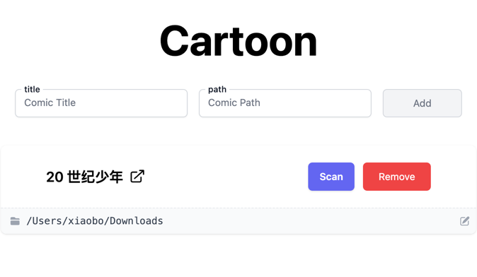
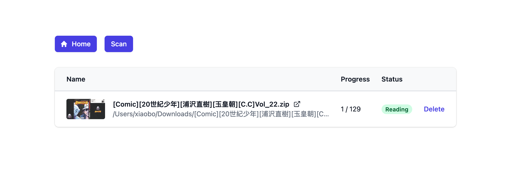
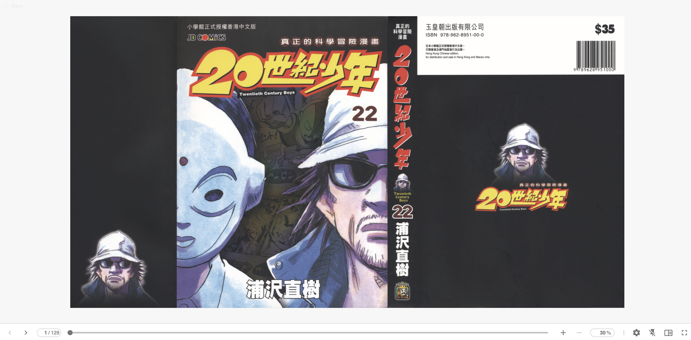

This project is [Simple Cartoon](https://github.com/bxb100/simple-cartoon)'s UI part

## Home

## Volume

## Reader

## Using
* This is a [Next.js](https://nextjs.org/) project bootstrapped with [`create-next-app`](https://github.com/vercel/next.js/tree/canary/packages/create-next-app)
* Using [tailwindcss](https://tailwindcss.com/)
* Using [Villain](https://github.com/btzr-io/Villain) with `iframe`
